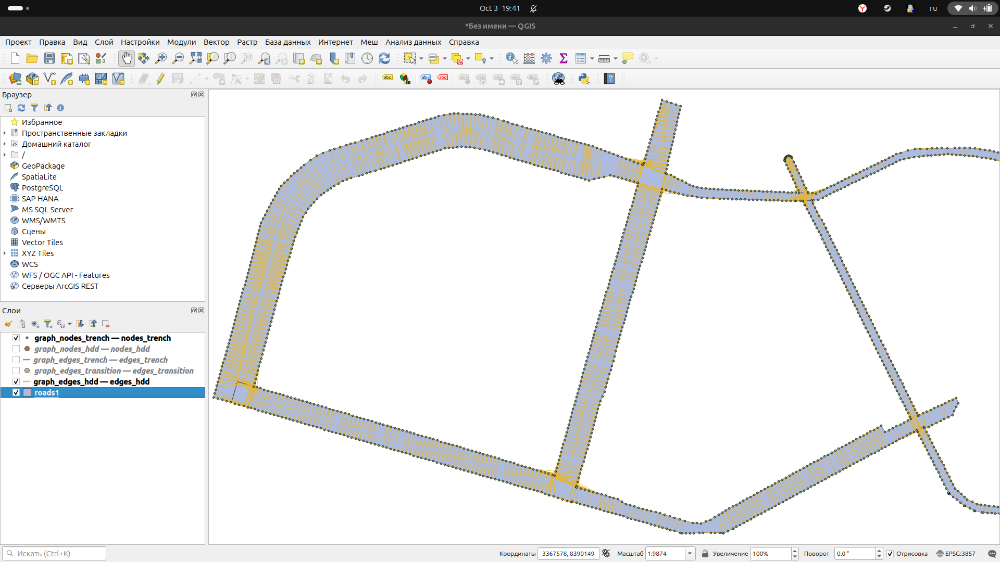

## Быстрая сборка
### Генерация
```bash
cmake -S . -B build -DCMAKE_BUILD_TYPE=Release
```
### Сборка
```bash
cmake --build build --config Release
```
### Запуск
```bash
./build/reader --roads roads1.geojson --out graph --config config.json 
```

## О коде
- Файлы читаются и записываются
- Все вершины правильно ставятся, в том числе на улах перекрестков, чтоб была связность
- Траншеи идут вдоль дорог без их пересечения (по правилам из конфига)
- Переходы из траншей в ГНБ обозначены вершинами для визуализации (закомментирован код, делающий их ребрами с весом, но нулевой длинной)
-  Едниственное, что требует доделывания - ребра ГНБ (то есть только файл hdd.cpp):

1) если сделать функцию all_intersections_within_perp_band (проверяет отклонение угла) всегда возвращающей true, то проведутся все нужные нам ребра без учета отклонения угла (alpha = pi/2)

2) без этого в функции видимо есть баги, так как вроде проводятся не все отрезки, но бОльшая их часть + какие-то явно лишние отрезки  (на картинке ГНБ для примера в этом случае с отклонением в 10 градусов)

